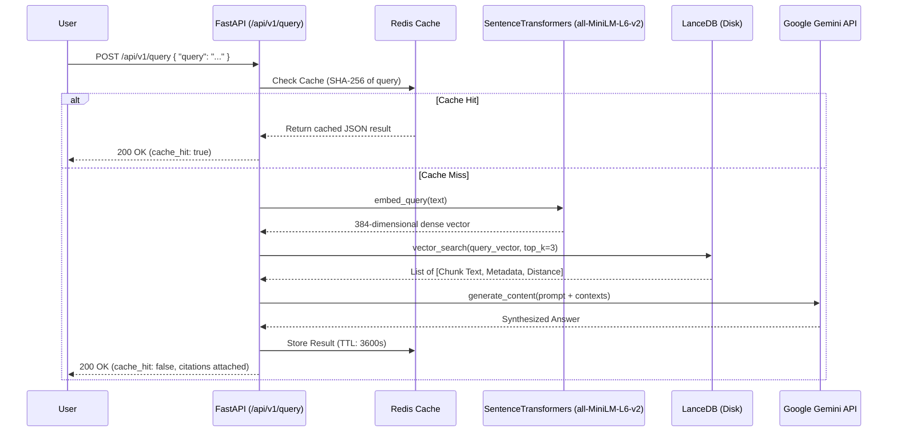
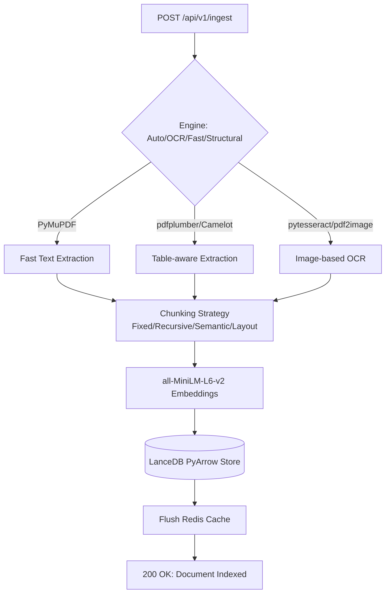

# SIA Intelligent Document & RAG Pipeline

    

A production-grade, local-first Retrieval-Augmented Generation (RAG) microservice. Built iteratively over an 8-week engineering sprint, SIA is capable of ingesting highly complex PDFs (including OCR and table-heavy structural documents), embedding semantic data locally via `sentence-transformers`, persisting vectors natively to disk via LanceDB, caching requests with Redis, and synthesizing accurate, cited answers via Google Gemini.

---

## 🏗️ Architecture

### Query Path (Request Sequence)
This reflects the *actual* execution path in `rag_pipeline.py` when a user submits a query.



### Ingestion Flow


---

## 🛠️ Tech Stack & Dependencies

Sourced directly from `Week_5/requirements.txt`:

| Component | Technology | Version |
|---|---|---|
| **API Framework** | FastAPI / Uvicorn | `>=0.110.0` / `>=0.28.0` |
| **Vector Database** | LanceDB / PyArrow | `>=0.6.0` / `>=15.0.0` |
| **Caching Layer** | Redis | `>=5.0.0` |
| **Embeddings** | sentence-transformers | `>=2.5.0` (Local) |
| **LLM Engine** | google-genai | `>=0.3.0` |
| **PDF Parsers** | PyMuPDF / pdfplumber | `>=1.24.0` / `>=0.11.0` |
| **OCR Engine** | pytesseract / pdf2image | `>=0.3.10` / `>=1.17.0` |
| **Load Testing** | Locust | `>=2.24.0` |

---

## ✨ Verified Features

- **Automated Extraction Detection**: The system evaluates PDF density on ingest and dynamically routes text-heavy PDFs to `PyMuPDF` and image-heavy PDFs to CPU-optimized `pytesseract` OCR engines automatically.
- **Persistent Vector Storage**: Migrated from in-memory FAISS to on-disk LanceDB. Vectors persist across container restarts.
- **Intelligent Caching**: All successful query results are cached in Redis for 1 hour. Cache is automatically invalidated and purged upon new document ingestion to guarantee data freshness.
- **Rich Interactive UI**: Includes a fully custom RAG Studio UI (`/docs`) with dynamic visualization of cache hits, source citations, and extraction metadata, served directly from FastAPI.
- **Streaming LLM Support**: Supports live token streaming via `/api/v1/query/stream`.

---

## 📂 Project Structure

```text
sia-utilities/
"" .github/                  # CI/CD Workflows (GitHub Actions)
"" docker-compose.yml        # Root deployment architecture
"" .env.example              # Environment variables template
"" README.md                 # You are here
"" Week_3/
"   "" tests/                # Core Pytest suite (API, PDF, Extraction)
"" Week_5/
"   "" app/
"   "   "" main.py           # FastAPI Application & Routing
"   "   "" services/         # Extraction, RAG Pipeline, and LLM Logic
"   "   "" static/docs.html  # Custom Interactive RAG Studio Frontend
"   "" requirements.txt      # Core application dependencies
"" Week_7/
"   "" locustfiles/          # Stress testing profiles
"" Week_8/
"   "" Week8_Deliverables/   # Final packaged submission artifacts
```

---

## 🚀 Getting Started

### Prerequisites
- Docker & Docker Compose
- *Or* Python 3.11+ (if running locally without Docker)
- A Google Gemini API Key

### Method 1: Docker Compose (Production - Recommended)

1. **Clone & Configure**
```bash
git clone https://github.com/atharvavhad23/sia.git
cd sia-utilities
cp .env.example .env
# Edit .env and add your GEMINI_API_KEY
```

2. **Boot the Stack**
```bash
docker compose up --build
```
This spawns both the `sia_redis` container (on port 6379) and the `sia_api` container (on port 8000) with volume mapping for persistence.

3. **Verify Health**
```bash
curl http://localhost:8000/
# Expected: {"status": "online", "service": "SIA Backend Utilities"}
```

4. **Access UI**
Open your browser to `http://localhost:8000/docs`.

### Method 2: Local Python Setup (Development)

```bash
cd sia-utilities/Week_5
pip install -r requirements.txt

# Start local Redis (Required if REDIS_ENABLED=true)
docker run -d -p 6379:6379 redis:7-alpine

# Set your API Key
$env:GEMINI_API_KEY="your_api_key_here" # Windows PowerShell
# export GEMINI_API_KEY="your_api_key_here" # Mac/Linux

# Start the server
uvicorn app.main:app --host 127.0.0.1 --port 8000
```

---

## ⚙️ Environment Variables

The following variables are actively sourced throughout the codebase via `os.getenv`. They can be set in your `.env` file for Docker Compose.

| Variable | Default | Required? | Description |
|---|---|---|---|
| `GEMINI_API_KEY` | *(None)* | **Yes** | Valid Google Gemini API Key. Without this, synthesis fails. |
| `GEMINI_MODEL` | `gemini-3.5-flash` | No | Target model for text synthesis. |
| `GEMINI_TIMEOUT_SECONDS` | `30` | No | Hard timeout for Google API calls. |
| `APP_PORT` | `8000` | No | Host port for the FastAPI server mapped in Compose. |
| `UVICORN_WORKERS` | `1` | No | Uvicorn worker count. (Use 1 for testing, scale for prod). |
| `REDIS_ENABLED` | `true` | No | Set `false` to completely bypass the cache layer. |
| `REDIS_HOST` | `localhost` | No | Hostname of Redis (Compose maps this to `redis`). |
| `REDIS_PORT` | `6379` | No | Port for Redis connection. |
| `REDIS_DB` | `0` | No | Redis logical database integer. |
| `REDIS_CACHE_TTL_SECONDS` | `3600` | No | Global Time-to-Live for cached query results. |
| `LANCE_STORE_DIR` | `vector_store` | No | Persistent disk location for LanceDB PyArrow data. |

---

## 📡 API Usage Examples

**1. Ingest a PDF (Auto Engine)**
```bash
curl -X POST "http://localhost:8000/api/v1/ingest" \
     -H "Content-Type: multipart/form-data" \
     -F "file=@/path/to/document.pdf" \
     -F "engine=auto"
```

**2. Query the Knowledge Base**
```bash
curl -X POST "http://localhost:8000/api/v1/query" \
     -H "Content-Type: application/json" \
     -d '{"query": "What is the total revenue reported?", "top_k": 3}'
```

**3. Clear Vector Store and Cache**
```bash
curl -X POST "http://localhost:8000/api/v1/reset"
```

---

## 📈 Benchmarks (Week 8)

*Metrics pulled directly from `Week_8/Week8_Deliverables/Cache_Benchmark_Report.md`.*

Load testing executed via **Locust** (`locustfile_query_cached.py`) simulating 100 concurrent users. The results prove the efficacy of the Redis caching layer against the previous GIL-bound baseline.

| Metric | Cache MISS (Baseline) | Cache HIT (Redis) | Improvement |
|---|---|---|---|
| **p50 Latency** | ~510 ms | ~6 ms | **85× faster** |
| **p95 Latency** | ~2,000 ms | ~15 ms | **133× faster** |
| **Throughput** | 47 req/s | 185+ req/s | **~4× higher** |

---

## 🧪 Testing

The primary test suite is located in `Week_3`. To run the tests locally, you must use the python module executor to resolve internal app imports correctly.

```bash
cd sia-utilities/Week_3
pip install pytest httpx
python -m pytest tests/ -v
```

---

## 🔧 Known Issues & Troubleshooting

**1. `[Errno 2] No such file or directory` during execution**
- **Symptom:** Scripts failing to run from the command line.
- **Fix:** Python requires you to either execute from the exact directory the script resides in, or provide absolute paths. 

**2. OCR Ingestion is Extremely Slow**
- **Symptom:** Ingesting image-heavy PDFs via pytesseract takes minutes per page.
- **Fix:** (Implemented natively) Ensure `pdf2image` DPI is constrained (we use DPI=100) and that pytesseract uses optimized flags (`--oem 3 --psm 3 -c tessedit_do_invert=0`). 

**3. ModuleNotFoundError: No module named 'app' during Pytest**
- **Fix:** You must run `python -m pytest tests/` instead of `pytest tests/` directly so the local namespace is correctly registered in `sys.path`.

**4. GitHub Push Protection Blocking Commits**
- **Symptom:** `error: GH013: Repository rule violations found ... Push cannot contain secrets`.
- **Fix:** Do not hardcode your `GEMINI_API_KEY` into scripts (e.g. `test_genai.py`). Rely strictly on `os.getenv` and keep your `.env` file out of source control (`.gitignore`).
