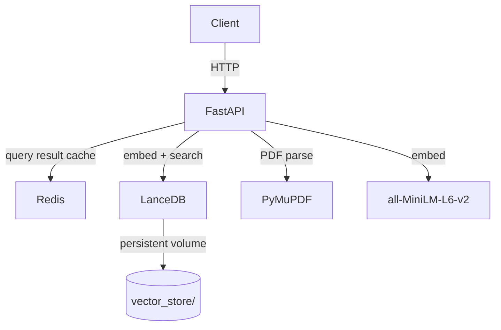

# SIA — Semantic Intelligent Agent RAG Microservice

> A production-grade, local-first Retrieval-Augmented Generation (RAG) pipeline built over 8 weeks. Ingest PDFs, embed with MiniLM, search with LanceDB, and get extractive answers — all in a single `docker compose up`.

## Architecture



## Quick Start

### Prerequisites
- Python 3.11+
- Docker & Docker Compose (for containerized deployment)

### Run Locally
```bash
# 1. Clone and enter the project
git clone <repo-url>
cd sia-utilities/Week_5

# 2. Install dependencies
pip install -r requirements.txt

# 3. (Optional but recommended) Start Redis for caching
docker run -d -p 6379:6379 redis:7-alpine

# 4. Start the server
uvicorn app.main:app --host 127.0.0.1 --port 8000

# 5. Open the RAG Studio UI
open http://127.0.0.1:8000/docs
```

### Run via Docker Compose (Recommended for Production)
```bash
# 1. Copy and configure environment variables
cp .env.example .env

# 2. Start the full stack (API + Redis + persistent LanceDB volume)
docker compose up

# 3. Verify health
curl http://localhost:8000/
# Expected: {"status": "online", "service": "SIA Backend Utilities"}
```

## Environment Variables

| Variable | Default | Description |
|---|---|---|
| `APP_PORT` | `8000` | Host port for the FastAPI server |
| `UVICORN_WORKERS` | `1` | Uvicorn worker count. See scaling notes below. |
| `REDIS_HOST` | `localhost` | Redis hostname (`redis` inside Docker) |
| `REDIS_PORT` | `6379` | Redis port |
| `REDIS_ENABLED` | `true` | Set `false` to measure raw latency without cache |
| `REDIS_CACHE_TTL_SECONDS` | `3600` | Query result TTL. Purged on new document ingest. |

See [`.env.example`](.env.example) for the full list.

## Running Tests
```bash
cd Week_3
pytest tests/ -v
```

## API Endpoints

| Method | Endpoint | Description |
|---|---|---|
| `GET` | `/` | Health check |
| `GET` | `/api/v1/health/metrics` | CPU/Memory via psutil |
| `POST` | `/api/v1/ingest` | Upload & vectorize a PDF |
| `POST` | `/api/v1/query` | Semantic search with extractive QA |
| `POST` | `/api/v1/reset` | Wipe the vector store |
| `GET` | `/docs` | Interactive RAG Studio UI |

## Scaling Guidance (from Week 7)
- **< 150 concurrent users**: Single Uvicorn worker (`UVICORN_WORKERS=1`) handles load safely (p95 < 2s).
- **150 – 600 users**: Scale to `UVICORN_WORKERS=4`. LanceDB is file-based and stateless per-process.
- **> 600 users** or **heavy ingest traffic**: Move ingestion to a Celery/RQ background queue. See [Week 8 Deployment Guide](Week_8/docs/Deployment_Guide.md).

## Architecture Evolution
| Week | Change | Why |
|---|---|---|
| Week 4 | FAISS in-memory vector store | Zero-dependency baseline for benchmarking |
| Week 5 | **Migrated to LanceDB** | Persistent, on-disk PyArrow-native store; eliminates reload on restart |
| Week 6 | Retrieval bake-off (Dense vs BM25 vs Hybrid vs Reranker) | Dense via LanceDB won: 1.0 Recall@3, <20ms latency |
| Week 7 | Locust stress testing | Ceiling: 150 users on 1 worker; GIL bottleneck under mixed ingest+query load |
| Week 8 | Redis caching + Docker + CI/CD | Targeted the query-path bottleneck; enables reproducible deployment |

## Full Documentation
- [Deployment Guide](Week_8/docs/Deployment_Guide.md)
- [Architecture Diagrams](Week_8/docs/Architecture_Diagrams.md)
- [Final Engineering Report](Week_8/reports/Final_Engineering_Report.md)
