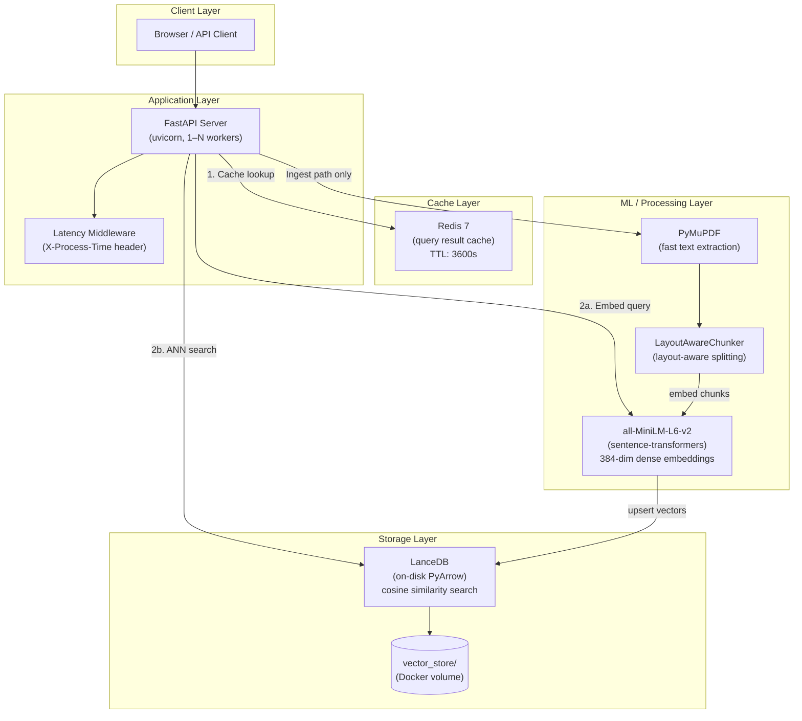
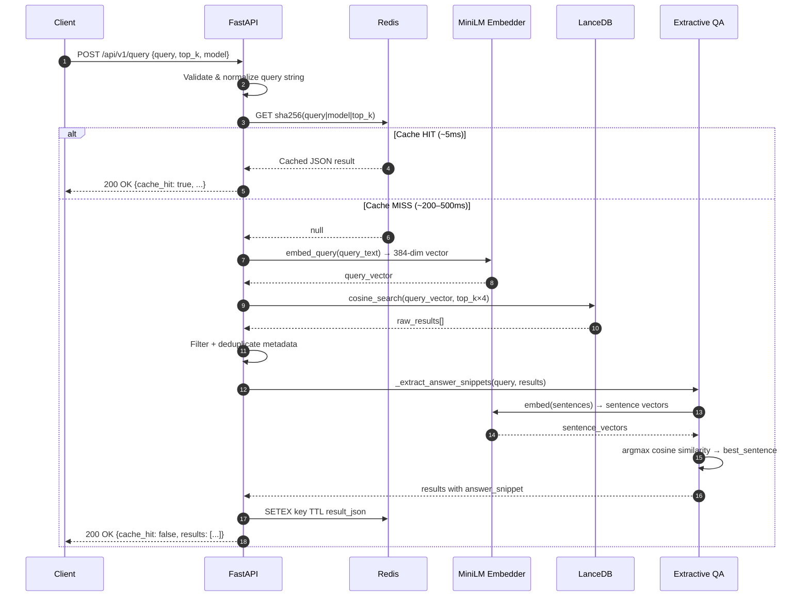
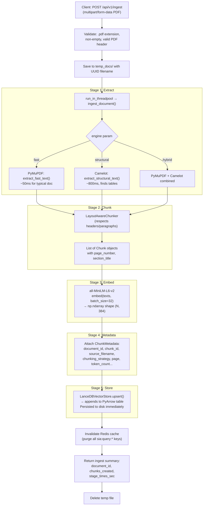

# Architecture Diagrams — SIA RAG Microservice

> All diagrams are Mermaid source so they live in version control as text and render natively in GitHub, GitLab, and most markdown previewers.

---

## 1. System / Component Diagram

Shows every service in the deployed stack and how they communicate.

---

## 2. Query Request Sequence Diagram

Detailed step-by-step flow for a single `POST /api/v1/query` request.

---

## 3. Document Ingestion Flow

Flow for a `POST /api/v1/ingest` request (CPU-heavy, run in threadpool).

